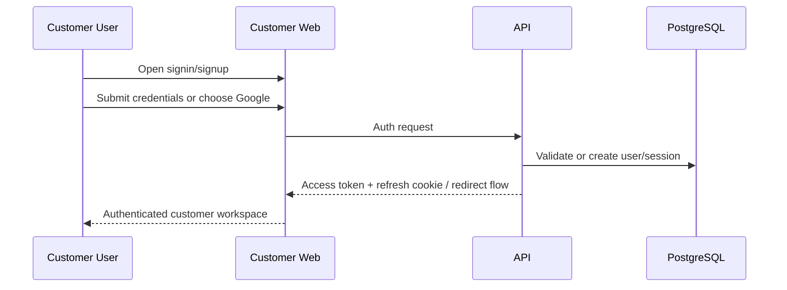
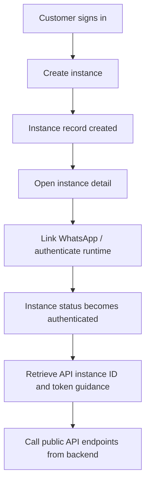
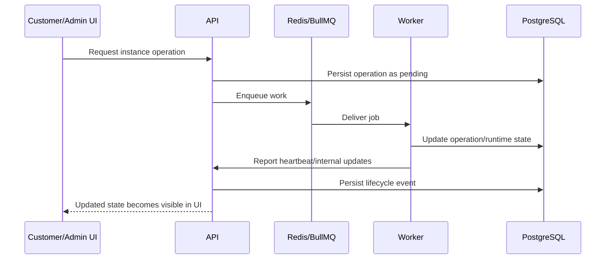
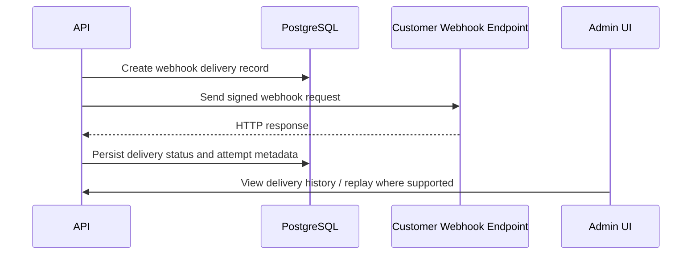

# Flowcharts and Sequence Diagrams

Status date: 2026-04-12

## Customer Authentication Flow

## Instance Creation to API Usage

## Worker and Lifecycle Operation Sequence

## Webhook Delivery Flow

## Documentation Note

These diagrams represent the intended current runtime relationships at a level suitable for product, architecture, and onboarding documentation. Detailed route payloads and entity fields remain documented in the API and schema references.
