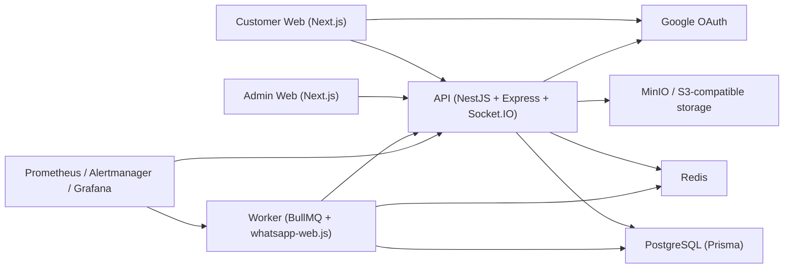

# System Architecture Document

Status date: 2026-04-12

## Overview

Elite Message is organized as a monorepo with four primary runtime applications:

- customer web
- admin web
- API
- worker

These applications depend on shared packages for configuration, contracts, UI primitives, and database access.

## Runtime Architecture

## Architectural Characteristics

- multi-application, role-separated UI surfaces
- centralized API and persistence model
- queue-backed worker execution
- typed shared contracts and shared environment parsing
- local operational tooling through Docker Compose

## Current-State Assessment

What is clearly implemented:

- customer and admin web apps
- a structured NestJS API surface
- a runtime worker with queue-backed dependencies
- a rich Prisma data model
- observability configuration assets

What remains partially mature:

- production hardening depth
- operational runbooks
- formal release documentation

## Supporting Infrastructure

- PostgreSQL stores tenant, runtime, audit, support, and message data
- Redis supports queue-backed and worker-related flows
- MinIO supports S3-compatible object storage needs
- Prometheus, Grafana, and Alertmanager are provisioned for local observability
